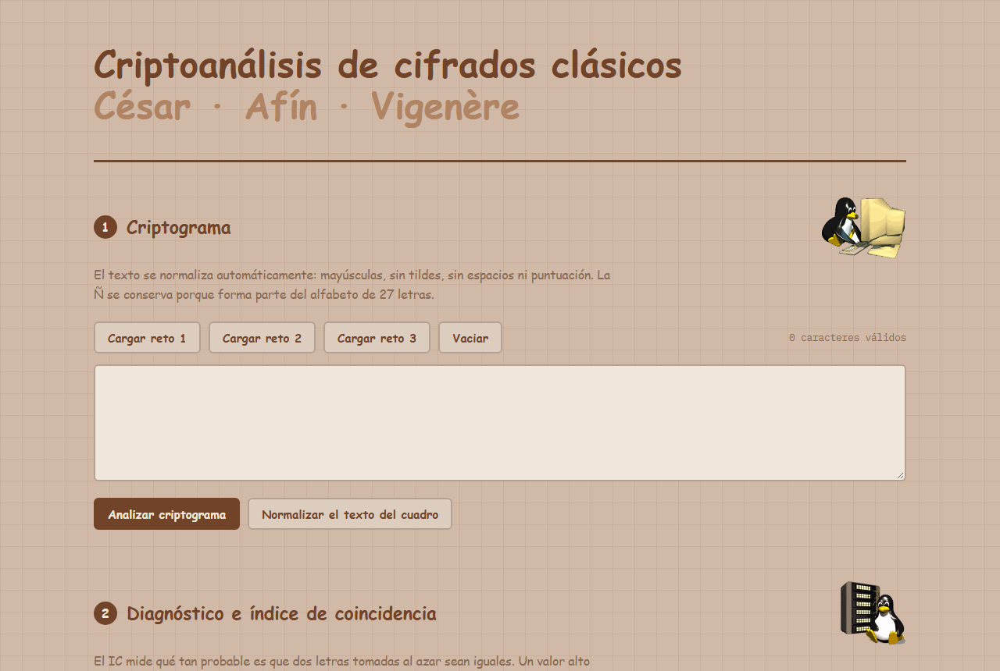

<div align="center">

# Criptoanálisis de Cifrados Clásicos

Herramienta web para **romper cifrados César, Afín y Vigenère** sobre el alfabeto español de 27 letras (A–Ñ–Z),
usando análisis estadístico: índice de coincidencia, frecuencias, ji-cuadrado y método de Kasiski.




</div>

---

## Descripción

Proyecto académico de **seguridad informática** (Ingeniería de Sistemas, Universidad El Bosque). A partir de un
criptograma, la herramienta diagnostica qué tipo de cifrado se usó y recupera la clave paso a paso, mostrando
cada cálculo para que el proceso se pueda seguir y verificar.

Todo se ejecuta **en el navegador**, en un único archivo `index.html`: no hay servidor, base de datos ni librerías externas.

## Flujo de análisis

```
Criptograma
   │  normalización: mayúsculas, sin tildes, espacios ni puntuación (la Ñ se conserva)
   ▼
Diagnóstico ── Índice de Coincidencia (IC)
   │             IC ≥ 0.055 → monoalfabético (César / Afín, según el mejor ji-cuadrado)
   │             IC < 0.055 → polialfabético (Vigenère)
   ▼
Ataque según el tipo
   ├── César     → fuerza bruta de los 27 desplazamientos, ordenados por ji-cuadrado
   ├── Afín      → sistema de ecuaciones con las letras más frecuentes
   │               + barrido de las 486 claves válidas (a coprimo con 27)
   └── Vigenère  → Kasiski (secuencias repetidas y sus distancias)
                   + IC por período para estimar la longitud de la clave
                   + ji-cuadrado por columna para deducir cada letra de la clave
   ▼
Texto descifrado + clave
```

## Funcionalidades

- **Análisis de frecuencias** comparado con las frecuencias esperadas del español.
- **Índice de coincidencia** del texto completo y por período.
- **César**: las 27 rotaciones ordenadas por puntaje ji-cuadrado.
- **Afín**: resolución por ecuaciones modulares (con inverso multiplicativo mod 27) y verificación por fuerza bruta.
- **Vigenère**: método de Kasiski, estimación de la longitud de clave y deducción automática de la clave.
- **Cifrador / descifrador** integrado para los tres métodos, útil para comprobar los resultados en ambos sentidos.
- Retos precargados y opción de copiar el texto descifrado.

## Conceptos aplicados

- Aritmética modular y cálculo del inverso multiplicativo módulo 27.
- Estadística del lenguaje: distribución de letras en español, índice de coincidencia y prueba ji-cuadrado.
- Criptoanálisis de cifrados por sustitución monoalfabética y polialfabética.

## Uso

Abre `index.html` en cualquier navegador moderno. No requiere instalación.

También se puede publicar en **GitHub Pages**: *Settings → Pages → Deploy from a branch → `main` / root*.

## Autor

**Gianfranco Peniche Uribe** — Estudiante de Ingeniería de Sistemas, Universidad El Bosque
[GitHub @Giaxeri](https://github.com/Giaxeri)
